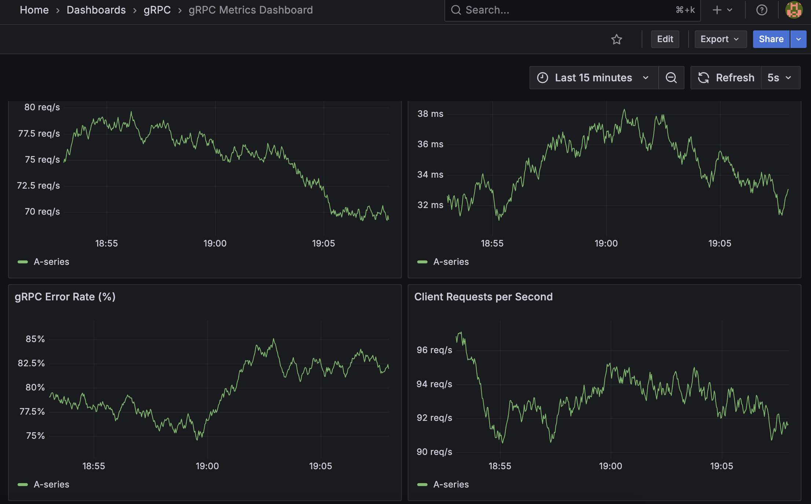

# Step 15: gRPC Metrics and Grafana Dashboards

This step demonstrates how to monitor gRPC services using Prometheus and visualize the metrics with Grafana dashboards.

## Features

- gRPC server with Prometheus metrics instrumentation
- gRPC client with custom Prometheus metrics
- Prometheus for metrics collection
- Grafana for visualization with pre-configured dashboards
- Docker Compose for easy setup

## Prerequisites

- Go 1.16 or higher
- Docker and Docker Compose
- protoc and Go plugins (install with `make install-protoc-plugins`)

## Getting Started

1. **Install Dependencies**
   ```bash
   make setup
   ```

2. **Generate Protobuf Code**
   ```bash
   make generate
   ```

3. **Start the Monitoring Stack** (in a new terminal)
   ```bash
   make run-metrics
   ```

4. **Start the gRPC Server** (in a new terminal)
   ```bash
   make run-server
   ```

5. **Start the gRPC Client** (in a new terminal)
   ```bash
   make run-client
   ```

## Accessing the Dashboards

- **Grafana**: http://localhost:3000
  - Username: `admin`
  - Password: `admin`
  - The dashboard will be available at: http://localhost:3000/d/grpc-metrics-dashboard/grpc-metrics-dashboard

- **Prometheus**: http://localhost:9090

## Metrics Collected

### Server-side Metrics (via grpc-prometheus)
- Request rate
- Error rate
- Latency distribution
- Request/response sizes
- Active streams

### Client-side Metrics (custom)
- Request count by method and status
- Request duration by method and status

## Dashboard Panels



Here's how the Grafana dashboard looks with the gRPC metrics:

1. **gRPC Requests per Second**
   - Shows the request rate for each gRPC method

2. **gRPC 95th Percentile Latency (ms)**
   - Shows the 95th percentile latency for each gRPC method

3. **gRPC Error Rate (%)
   - Shows the error rate for each gRPC method by status code

4. **Client Requests per Second**
   - Shows the client-side request rate by method and status

## Troubleshooting

- If you get port conflicts, check and stop any services using ports 3000, 9090, 50051, 9092, or 9093
- Make sure Docker is running before starting the monitoring stack
- Check the logs of each service if something doesn't work as expected

## Cleanup

To stop all services and clean up:

```bash
make stop-metrics
```

## Next Steps

- Add more detailed metrics and custom dashboards
- Set up alerts in Grafana
- Add tracing with Jaeger or OpenTelemetry
- Implement service discovery for dynamic environments
